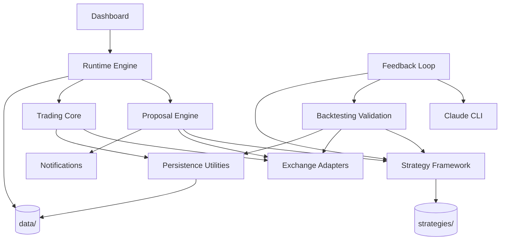

# Component Dependency

## Runtime Dependency Flow

## Dependency Rules

| Rule | Rationale |
|------|-----------|
| Strategy artifacts are loaded by the strategy framework, not imported ad hoc by runtime code. | Keeps NFR-010 file-based extensibility intact. |
| Proposal/runtime code must pass through trading-core gates before execution. | Preserves operator approval and live-trading safety. |
| Live execution reaches exchanges only through exchange adapters. | Keeps credential and exchange behavior centralized. |
| AI feedback reaches Claude through `src/ai/claude.py` and the local CLI boundary. | Preserves CON-001 and NFR-002. |
| Persistence helpers should be reused for JSON/JSONL writes. | Reduces corruption and timestamp drift risk. |
| Dashboard code reads persisted/operator state; it should not become the execution authority. | Keeps UI observation separate from trading control. |

## High-Risk Couplings

| Coupling | Risk | Verification Focus |
|----------|------|--------------------|
| Proposal -> Trading | Accepted proposals can execute trades | Accept/reject persistence, live confirmation, cap gates |
| Trading -> Exchange | Live orders can move real funds | Credential resolution, testnet/live distinction, fail-fast behavior |
| Strategy -> Backtest -> Promotion | Overfit strategies may be promoted | Robustness gates, hypothesis and failure-mode requirements |
| Runtime -> Persistence | Partial writes can corrupt operator state | Atomic writes, JSONL rotation, timestamp consistency |
| Sub-Account -> Trading/Backtest/Dashboard | State can appear mixed between accounts | Path isolation, default migration compatibility, dashboard labeling |
