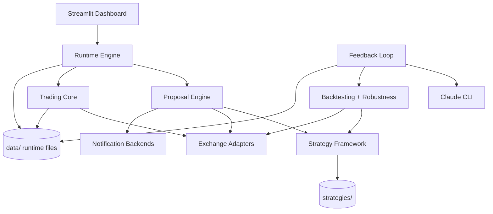
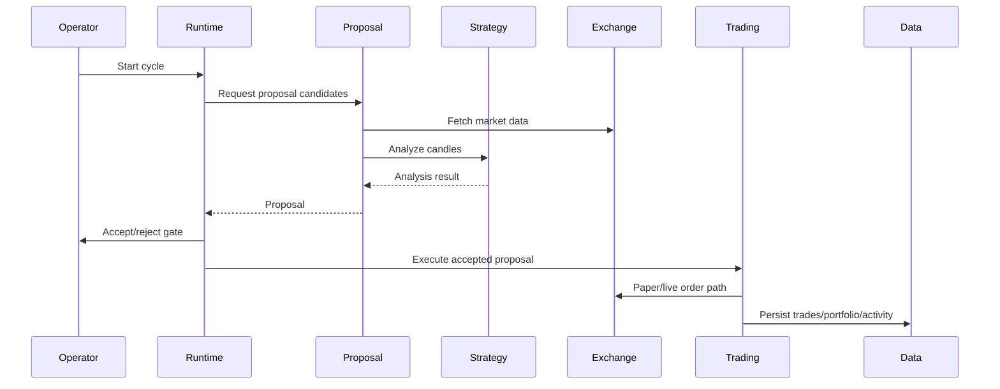

# System Architecture

## System Overview

Crypto Master is a Python modular monolith. It uses local files for strategies,
runtime state, audit trails, backtest artifacts, and trade records. External
dependencies include exchange APIs through `ccxt`, Claude CLI through a local
subprocess boundary, Streamlit for the dashboard, and optional notification
channels.

## Architecture Diagram

## Component Descriptions

| Component | Purpose | Dependencies | Type |
|-----------|---------|--------------|------|
| `src/exchange/` | Common exchange interface and Binance/Bybit adapters | `ccxt`, config, models | Client |
| `src/strategy/` | Strategy base classes, loading, indicators, performance models | strategies files, pandas/numpy | Application |
| `src/backtest/` | Backtest engine, analyzer, snapshot support, validation | exchange, strategy, pandas | Application |
| `src/ai/` | Claude CLI wrapper and strategy improver | subprocess CLI, strategies | Client/Application |
| `src/feedback/` | Feedback loop orchestration and audit | ai, backtest, strategy | Application |
| `src/proposal/` | Proposal generation, interaction, notifications | strategy, exchange, trading | Application |
| `src/runtime/` | Runtime engine cycles and activity logs | proposal, trading, persistence | Application |
| `src/trading/` | Paper/live trading, portfolio, profiles, sub-accounts | exchange, config, data files | Application |
| `src/dashboard/` | Streamlit operator UI | runtime/trading data | Application |
| `src/utils/` | Atomic IO, time helpers, trading math | stdlib | Shared |

## Integration Points

| Integration | Purpose | Boundary |
|-------------|---------|----------|
| Binance | Market data and orders | `src/exchange/binance.py` |
| Bybit | Market data and orders | `src/exchange/bybit.py` |
| Claude CLI | AI completion and strategy generation | `src/ai/claude.py` |
| Streamlit | Web dashboard | `src/dashboard/app.py` |
| Fly.io | Deployment/runtime hosting | `fly.toml`, `Dockerfile`, `start.sh` |
| Notifications | Proposal/operator alerts | `src/proposal/notification.py` |

## Data Flow

## Deployment Model

The project includes local execution, Streamlit dashboard execution, and Fly.io
deployment support. Runtime data is file-backed under `data/`; credentials are
expected via environment variables or ignored local configuration.

