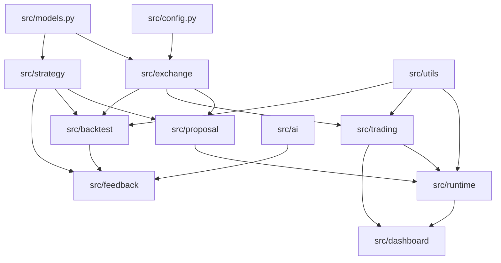

# Dependencies

## Internal Dependencies

## External Dependencies

| Dependency | Boundary | Notes |
|------------|----------|-------|
| Exchange APIs | `src/exchange/` | Binance and Bybit implemented; Tapbit deferred |
| Claude CLI | `src/ai/claude.py` | Required by NFR-002; no direct Anthropic API |
| Streamlit | `src/dashboard/` | Operator UI |
| Local filesystem | `data/`, `strategies/`, config paths | Persistence and strategy artifacts |
| Notification services | `src/proposal/notification.py` | Optional operator channels |

## Dependency Constraints

- Do not introduce a database unless requirements and migration plan are updated.
- Keep strategy addition file-based unless NFR-010 changes.
- Keep exchange changes behind the exchange abstraction.
- Keep live credentials outside source control.

